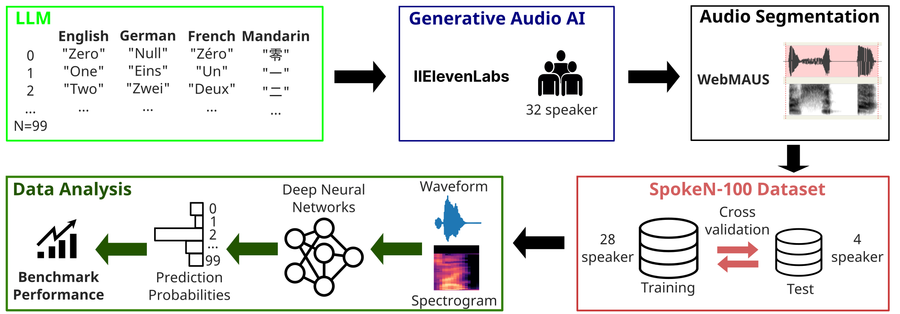

# SpokeN-100

SpokeN-100 is a novel, entirely artificially generated benchmarking dataset tailored for speech recognition, representing a core challenge in the field of tiny deep learning. SpokeN-100 consists of spoken numbers from 0 to 99 spoken by 32 different speakers in four different languages, namely English, Mandarin, German and French, resulting in 12,800 audio samples. The dataset can be downloaded via: https://zenodo.org/records/10810044.




## Repository
This repository contains all code for basic data analysis of SpokeN-100. Data splits for cross validation can be found in ['cross_validation_splits.csv'](cross_validation_splits.csv).

More details can be found in the publication: 

## Authors
- René Groh ([rene.groh@fau.de](mailto:rene.groh@fau.de]))
- Nina Goes
- Andreas M. Kist 


## Citation
If you use SpokeN-100 in your research, please cite our paper:

```
@article{,
    title = {SpokeN-100: A Cross-Lingual Benchmarking Dataset for The Classification of Spoken Numbers in Different Languages},
    journal = {},
    volume = {},
    pages = {},
    year = {2024},
    issn = {},
    doi = {},
    url = {},
    author = {Groh, René; Goes, Nina; Kist, Andreas M.},
    keywords = {datasets, neural networks, speech processing, tiny machine learning}
}
```